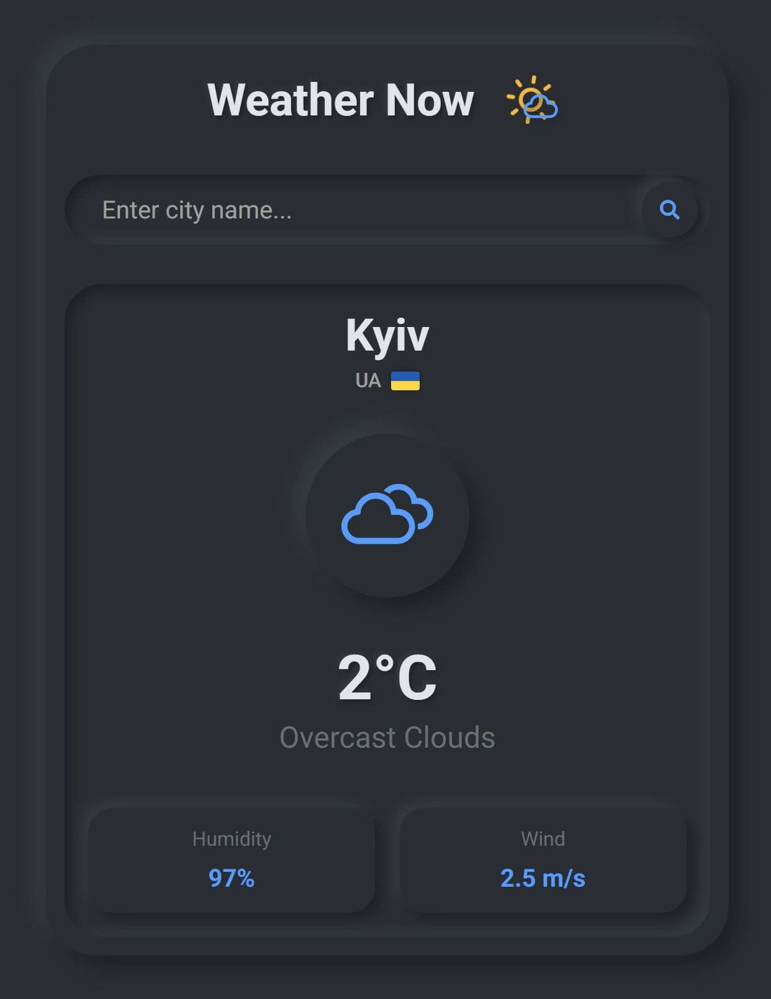

# Weather Now 🌤️

SPA weather application. Features city search with autocomplete, request caching, and a responsive interface.

## Screenshot



## Features

- **Search:** City search by name with dropdown suggestions (uses Geocoding API).
- **Data:** Displays current temperature, humidity, wind speed, and weather conditions.
- **Optimization:** API response caching in `localStorage` (cache duration — 10 minutes) to reduce network load.
- **UX:**
  - Persists the last selected city on page reload.
  - Skeleton loaders while fetching data.
  - Error handling and notifications (Toastify).
  - Closes the dropdown list when clicking outside the component.

## Tech Stack

- **Core:** React 19, Vite
- **Styles:** CSS Modules, Neumorphism (Soft UI) design, responsive design (Mobile First approach)
- **API:** OpenWeatherMap
- **Tools:** ESLint, React Icons

## Installation and Setup

1.  **Clone the repository and install dependencies:**

    ```bash
    npm install
    ```

2.  **Environment Setup:**
    Create a `.env` file in the project root using the example from `.env.example`. You will need to obtain your own API key from [OpenWeatherMap](https://openweathermap.org/).

    Example `.env` content:

    ```env
    VITE_WEATHER_API_KEY=your_api_key_here
    VITE_WEATHER_BASE_URL=https://api.openweathermap.org/data/2.5/weather
    VITE_GEO_BASE_URL=https://api.openweathermap.org/geo/1.0/direct
    VITE_FLAG_CDN_URL=https://flagcdn.com
    ```

3.  **Run the project:**
    ```bash
    npm run dev
    ```

## Project Structure

- `src/components` — UI components (isolated styles).
- `src/services` — API interaction logic and caching.
- `src/helpers` — Helper functions and constants.
- `src/hooks` — Custom hooks.
